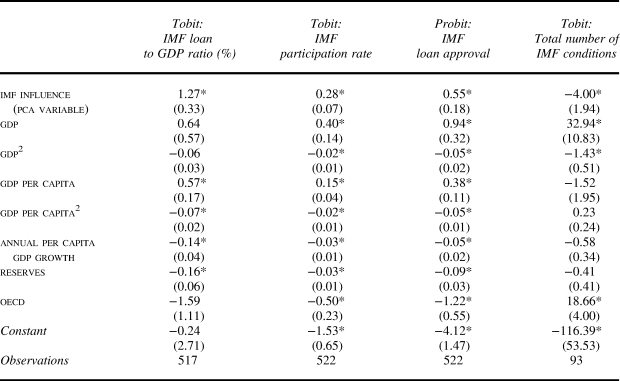

## Background (1/2)

-   Bretton Woods agreement in 1944: established the International Monetary Fund (IMF) and the World Bank [@jensen2004].

    -   World Bank: focuses on economic assistance for *development* projects.
    -   IMF: initially focused on *exchange rate stability* and *balance-of-payment* crises.

-   "Gentlemen's agreement" [@keating2024; @weiss2023]: 

    - the IMF managing director being a \alert{European};
    - the World Bank president being an American.

## Background (2/2)

-   IMF gradually expanded its role into *structural adjustment* and *domestic economic governance*, attaching \alert{conditions} to its loans [@barnett2004].

    - Neoclassical "sound economic" policies: fiscal austerity, trade liberalization, privatization, deregulation [@nelson2014].
    - Yet many have documented *negative* consequences [@garuda2000; @lang2020; @oberdabernig2013; @dreher2006; @przeworski2000; @casper2017; @hartzell2010].

- Neo-colonialism critique: serving the interests of the \alert{West} [@stone2011; @barnett2004; @cain2022; @chen2021; @hickel2020; @moyo2024].

## Research Question

Who has more influence over the IMF, the US or Europe?

-   US?

    -   HQ in the US

    -   US veto power

    -   US hegemony

    -   US deputy

    -   Case Study: Mexico

-   Europe?

    -   European managing director

    -   Case Study: Euro Crisis

-   Difficulties in comparison

    -   Consensus-based governance

    -   closed-door negotiations

## Empirical Strategy

-   Data source/empirical inspiration: @lipscy2018 (1980-2010)

    -   but their focus is the effect on self-insurance

    -   did not separate Europe from the US - 'Western influence'

-   Proxies for influence (merged through PCA)

    -   Number of nationals employed as IMF economists

    -   IMF quota.

    -   US: UN affinity score with US, trade volume with US, US bank lending

    -   European: UN affinity score with European powers, trade volume with European powers, European bank lending

## Empirical Strategy

-   Dependent variables

    -   IMF loan to GDP ratio, IMF participation rate

    -   IMF loan approval, IMF conditions

-   Independent variables

    -   IMF influence proxies

    -   GDP, Growth

    -   Reserves, OECD

-   Hypotheses

    -   $H_1$: Either the US or Europe has more influence over the IMF.

        -   Test of equality of the US and EU coefficients.

    -   $H_2$: The US/Europe exerts a statistically significant influence on IMF lending decisions, controlling for European/American influence.

## Results from [@lipscy2018]



## Preliminary Results

```{r results}
load('save/regTable.RData')
resultsTable |>
  tinytable::theme_latex(resize_width = 0.81, resize_direction = "down")
```

## Interpretation of Results

-   $H_1$: The evidence supports the hypothesis that Europe exerts greater influence over the IMF than the United States, particularly in determining loan amounts and participation rates.

-   $H_2$: The results offer a more nuanced view.

    -   European influence is statistically significant in shaping the loan-to-GDP ratio, participation rate, and loan approval.

    -   In contrast, US influence is **only** significant in reducing the number of IMF conditions.

    -   This finding echoes @lutz2014, who argue that European actors have historically adhered more strictly to the principles of the Washington Consensus than their US counterparts.

## References {.unnumbered .allowframebreaks}

::: {#refs}
:::
